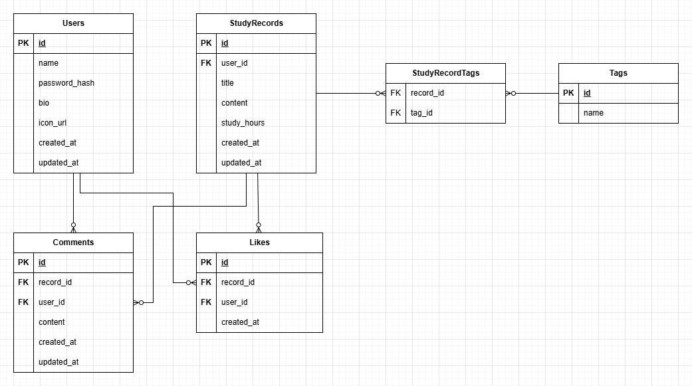

# Study Track — DB 設計ドキュメント

## 1. ERD（論理モデル）

### ERD 図



### エンティティ一覧

- Users
- StudyRecords（勉強記録）
- Comments
- Likes
- Tags
- StudyRecordTags（中間テーブル）

---

### Users

| カラム名      | 型           | 制約        |
| ------------- | ------------ | ----------- |
| id            | BIGSERIAL    | PRIMARY KEY |
| name          | VARCHAR(100) | NOT NULL    |
| password_hash | VARCHAR(255) | NOT NULL    |
| bio           | TEXT         |             |
| icon_url      | VARCHAR(255) |             |
| created_at    | TIMESTAMP    | NOT NULL    |
| updated_at    | TIMESTAMP    | NOT NULL    |

---

### StudyRecords

| カラム名    | 型           | 制約                   |
| ----------- | ------------ | ---------------------- |
| id          | BIGSERIAL    | PRIMARY KEY            |
| user_id     | BIGINT       | FOREIGN KEY → users.id |
| title       | VARCHAR(200) | NOT NULL               |
| content     | TEXT         | NOT NULL               |
| study_hours | INT          |                        |
| created_at  | TIMESTAMP    | NOT NULL               |
| updated_at  | TIMESTAMP    | NOT NULL               |

---

### Comments

| カラム名   | 型        | 制約                           |
| ---------- | --------- | ------------------------------ |
| id         | BIGSERIAL | PRIMARY KEY                    |
| record_id  | BIGINT    | FOREIGN KEY → study_records.id |
| user_id    | BIGINT    | FOREIGN KEY → users.id         |
| content    | TEXT      | NOT NULL                       |
| created_at | TIMESTAMP | NOT NULL                       |
| updated_at | TIMESTAMP | NOT NULL                       |

---

### Likes

| カラム名                   | 型        | 制約                           |
| -------------------------- | --------- | ------------------------------ |
| id                         | BIGSERIAL | PRIMARY KEY                    |
| record_id                  | BIGINT    | FOREIGN KEY → study_records.id |
| user_id                    | BIGINT    | FOREIGN KEY → users.id         |
| created_at                 | TIMESTAMP | NOT NULL                       |
| UNIQUE(record_id, user_id) |           |                                |

---

### Tags

| カラム名 | 型           | 制約             |
| -------- | ------------ | ---------------- |
| id       | BIGSERIAL    | PRIMARY KEY      |
| name     | VARCHAR(100) | UNIQUE, NOT NULL |

---

### StudyRecordTags（中間テーブル）

| カラム名                  | 型     | 制約                           |
| ------------------------- | ------ | ------------------------------ |
| record_id                 | BIGINT | FOREIGN KEY → study_records.id |
| tag_id                    | BIGINT | FOREIGN KEY → tags.id          |
| UNIQUE(record_id, tag_id) |        |                                |

---

---

## 2. PostgreSQL のローカル環境構築

### ① PostgreSQL をインストール

公式サイト: https://www.postgresql.org/download/

- Superuser（postgres）パスワード設定
- Port: 5432
- pgAdmin / Command Line Tools をインストール

---

### ② インストール確認

```sh
psql --version
```

### ③ データベース作成

```sh
psql -U postgres
```

```sql
CREATE DATABASE studytrack_db;
\c studytrack_db;
```

## 3. Study Track 用 PostgreSQL スキーマ

```sql
-- ================================
-- Users
-- ================================
CREATE TABLE users (
    id BIGSERIAL PRIMARY KEY,
    name VARCHAR(100) NOT NULL,
    password_hash VARCHAR(255) NOT NULL,
    bio TEXT,
    icon_url VARCHAR(255),
    created_at TIMESTAMP NOT NULL DEFAULT CURRENT_TIMESTAMP,
    updated_at TIMESTAMP NOT NULL DEFAULT CURRENT_TIMESTAMP
);

-- ================================
-- StudyRecords（勉強記録）
-- ================================
CREATE TABLE study_records (
    id BIGSERIAL PRIMARY KEY,
    user_id BIGINT NOT NULL,
    title VARCHAR(200) NOT NULL,
    content TEXT NOT NULL,
    study_hours INT,
    created_at TIMESTAMP NOT NULL DEFAULT CURRENT_TIMESTAMP,
    updated_at TIMESTAMP NOT NULL DEFAULT CURRENT_TIMESTAMP,

    CONSTRAINT fk_study_records_user
        FOREIGN KEY (user_id) REFERENCES users(id)
        ON DELETE CASCADE
);

-- ================================
-- Comments（コメント）
-- ================================
CREATE TABLE comments (
    id BIGSERIAL PRIMARY KEY,
    record_id BIGINT NOT NULL,
    user_id BIGINT NOT NULL,
    content TEXT NOT NULL,
    created_at TIMESTAMP NOT NULL DEFAULT CURRENT_TIMESTAMP,
    updated_at TIMESTAMP NOT NULL DEFAULT CURRENT_TIMESTAMP,

    CONSTRAINT fk_comments_record
        FOREIGN KEY (record_id) REFERENCES study_records(id)
        ON DELETE CASCADE,

    CONSTRAINT fk_comments_user
        FOREIGN KEY (user_id) REFERENCES users(id)
        ON DELETE CASCADE
);

-- ================================
-- Likes（いいね）
-- ================================
CREATE TABLE likes (
    id BIGSERIAL PRIMARY KEY,
    record_id BIGINT NOT NULL,
    user_id BIGINT NOT NULL,
    created_at TIMESTAMP NOT NULL DEFAULT CURRENT_TIMESTAMP,

    CONSTRAINT fk_likes_record
        FOREIGN KEY (record_id) REFERENCES study_records(id)
        ON DELETE CASCADE,

    CONSTRAINT fk_likes_user
        FOREIGN KEY (user_id) REFERENCES users(id)
        ON DELETE CASCADE,

    CONSTRAINT unique_like_per_user_per_record
        UNIQUE (record_id, user_id)
);

-- ================================
-- Tags（タグ）
-- ================================
CREATE TABLE tags (
    id BIGSERIAL PRIMARY KEY,
    name VARCHAR(100) NOT NULL UNIQUE
);

-- ================================
-- 中間テーブル（StudyRecordTags）
-- ================================
CREATE TABLE study_record_tags (
    record_id BIGINT NOT NULL,
    tag_id BIGINT NOT NULL,

    CONSTRAINT fk_srt_record
        FOREIGN KEY (record_id) REFERENCES study_records(id)
        ON DELETE CASCADE,

    CONSTRAINT fk_srt_tag
        FOREIGN KEY (tag_id) REFERENCES tags(id)
        ON DELETE CASCADE,

    CONSTRAINT unique_record_tag
        UNIQUE (record_id, tag_id)
);
```
